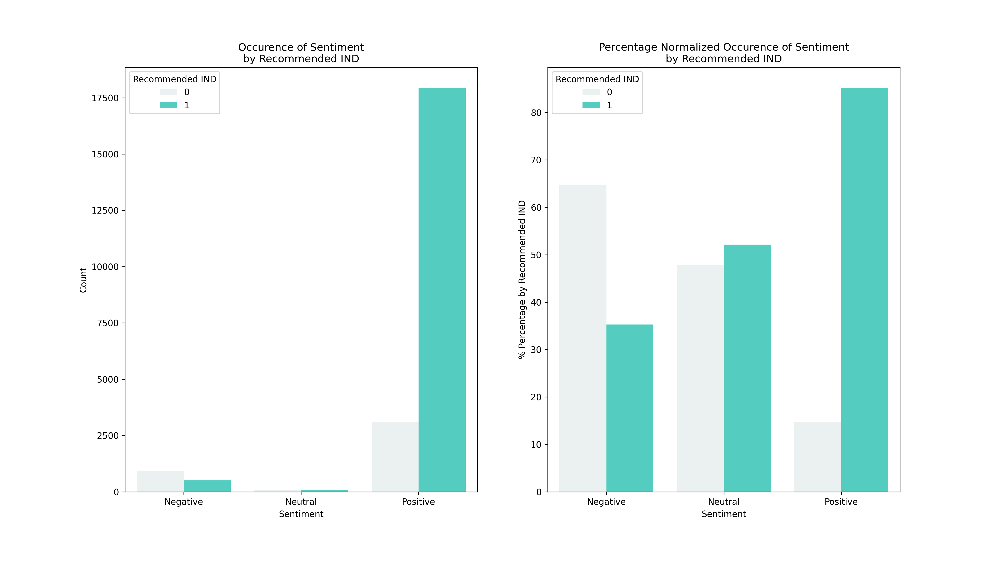
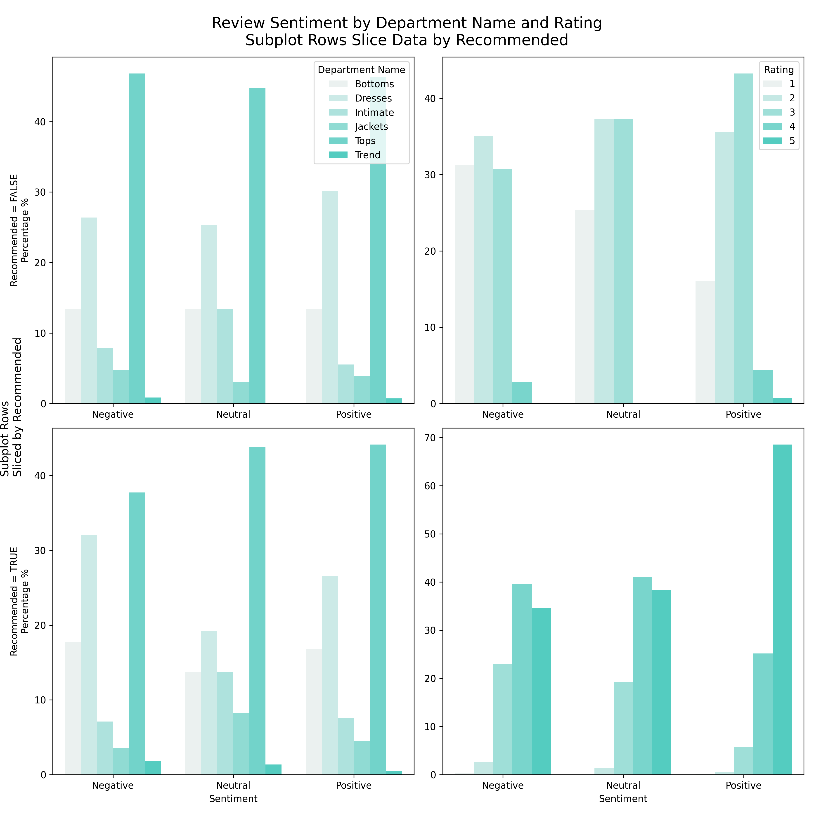
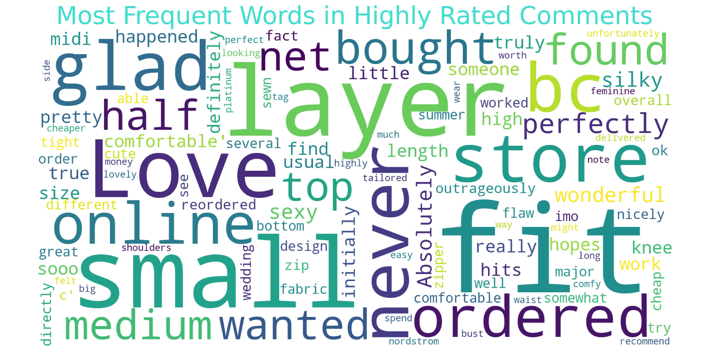

# EXPLORATORY DATA ANALYSIS USING WOMEN'S E-COMMERCE CLOTHING REVIEWS ON KAGGLE

## About Dataset
**Women's E-Commerce Clothing Reviews on Kaggle**

***Link Dataset***: 

https://www.kaggle.com/nicapotato/womens-ecommerce-clothing-reviews

***Context***

Welcome. This is a Women’s Clothing E-Commerce dataset revolving around the reviews written by customers. Its nine supportive features offer a great environment to parse out the text through its multiple dimensions. Because this is real commercial data, it has been anonymized, and references to the company in the review text and body have been replaced with “retailer”.

***Content***

This dataset includes **23486 rows** and **10 feature variables**. Each row corresponds to a customer review, and includes the variables:
- **Clothing ID**: Integer Categorical variable that refers to the specific piece 
being reviewed.
- **Age**: Positive Integer variable of the reviewers age.
- **Title**: String variable for the title of the review.
- **Review** Text: String variable for the review body.
- **Rating**: Positive Ordinal Integer variable for the product score granted by the customer from 1 Worst, to 5 Best.
- **Recommended** IND: Binary variable stating where the customer recommends the product where 1 is recommended, 0 is not recommended.
- **Positive Feedback Count**: Positive Integer documenting the number of other customers who found this review positive.
- **Division Name**: Categorical name of the product high level division.
- **Department Name**: Categorical name of the product department name.
- **Class Name**: Categorical name of the product class name.

***Acknowledgements***
Anonymous but real source

***Inspiration***
Nicapotato, an owner of dataset Women's E-Commerce Clothing Reviews that looks forward to coming quality NLP! There are also some great opportunities for feature engineering and multivariate analysis.

***Publication***
[Statistical Analysis on E-Commerce Reviews, with Sentiment Classification using Bidirectional Recurrent Neural Network](https://www.researchgate.net/publication/323545316_Statistical_Analysis_on_E-Commerce_Reviews_with_Sentiment_Classification_using_Bidirectional_Recurrent_Neural_Network)

by [Abien Fred Agarap - Github](https://github.com/AFAgarap/ecommerce-reviews-analysis)

## Metadata
**Usage Information**    
- License [CC0: Public Domain](https://creativecommons.org/publicdomain/zero/1.0/)
- Visibility **public**

**Maintainers**
- Dataset owner [nicapotato](https://www.kaggle.com/nicapotato)

**Updates**

    Expected update frequency (Not specified)
    Last updated 2018-02-04
    Date created 2018-02-04      
    Current version Version 1

## Objectives

**Problem Framing**
* Find Exploratory Data Analysis from the dataset

**Ideal Outcome**
* A success metric is that sentences could find insight for analysis.
* Success means text data excellent for making analysis. 
* Failure means text data used for sentiment predicted is no better than current heuristics.

**Heuristics**
* Consider the text data already for analysis. Assume that data used to exploratory graph and ext

**Formulation of the problem**
* Data Preparation and Explotratory Data Analysis

## Results

